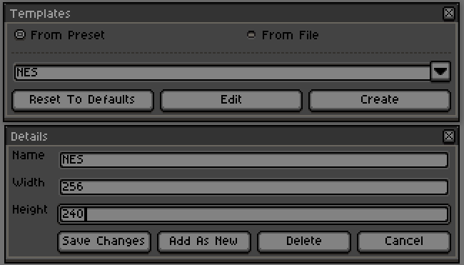

# FW_Templates
Aseprite Plugin to provide a means of starting documents from pre defined templates.

## What is it?
Like many pixel artists I sometimes partake in the prompts from the PixelDailies twitter account. For consistency all of those pieces are the same resolution, and use a similar setup with a background layer, and a foreground layer with a frame and logo. 

Remembering the resolution, copying in an image of the frame and setting up layers each time is a small but still unnecessary step for something that you're going to be using a lot. So I decided to learn how to make scripts for Aseprite, and after a bit of learning, and a lot of pining for my usual language of C#, I ended up with this templates plugin.

## Installation
As an aseprite extension, installation is simple.
1. Download the packaged version of this extension [here](https://github.com/HenryStrattonFW/FW_Templates/raw/master/FW_Templates.aseprite-extension)
2. Double click the downloaded file to install it in Aseprite.
3. Restart Aseprite (this script adds a menu command which does not appear on install but will on subsequent launches).
4. Access the templates feature via the "File > Templates" menu option that now appears.

## Preset Mode
The first of the two modes that this plugin supports is presets. These are very basic resolution only presets for new work. Just select a preset from the dropdown and hit create, simple as that. 
The plugin will automatically set a few presets that are hardcoded with the extension, however selecting a template and using the Edit button will allow you to add, remove, and update any of the presets in the list. These will be saved between your Aseprite sessions, but you can reset to the defaults at any time.

The included default presets are as follows.

 - NES - 256 x 240px
 - SNES - 256 x 224px
 - Genesis - 320 x 224px
 - Gameboy - 160 x 144px
 - Gameboy Advanced - 240 x 160px
 - GameCube - 640 x 480px
 - Pico-8 - 128 x 128px
 - PSP - 480 x 172px

## File Mode
For more complex templates, ones that may require preset image content, layers, groups, etc. The File template offers the support that is more in line with a traditional 'template' feature of other software. Simply select any existing .ase or .aseprite file, and hit create. This will create a brand new sprite which duplicates the selected source. How you organize your template files (all in one folder, or templates per project folder) is entirely up to you, any .ase or .aseprite file can be selected and used as a template file. 

***NOTE:** Changing the new files will have no impact on the original template file, to update a template, simply update the original file that you select*.

